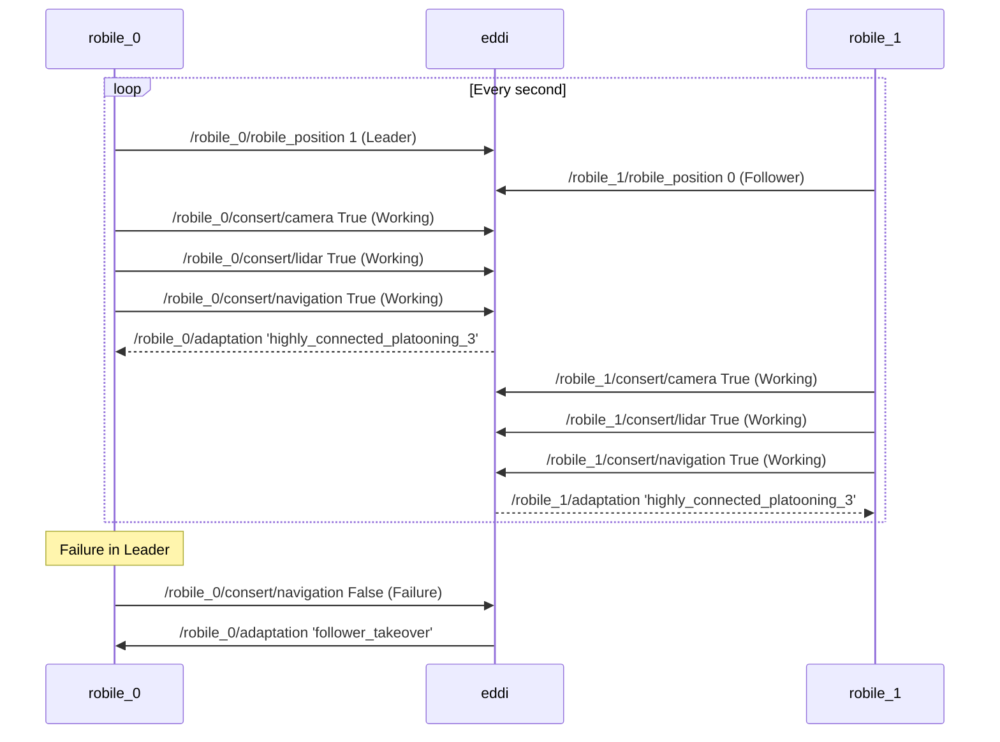

# multi_robile_navigation_experiments
# multi_robile_navigation_experiments

# Commands

In separate windows
``` bash
------ Window 1 Gazebo
$> ros2 launch robile_gazebo multi_robile_sim.launch.py
------ EDDI
$> ros2 launch eddi_monitor_launcher two_robile_eddi_with_adaptation.launch
------ Navigation stack
$> ros2 launch robile_navigation multi_nav2_bringup.launch.py
------ Robile 0 navigation behaviour starting as leader
$> cd multi_robile_navigation_experiments/multi_robile_navigation_experiments
$> python3 robile_0_behaviour.py
------ Robile 1 navigation behaviour starting as Follower
$> cd multi_robile_navigation_experiments/multi_robile_navigation_experiments
$> python3 robile_1_behaviour.py
``` 



