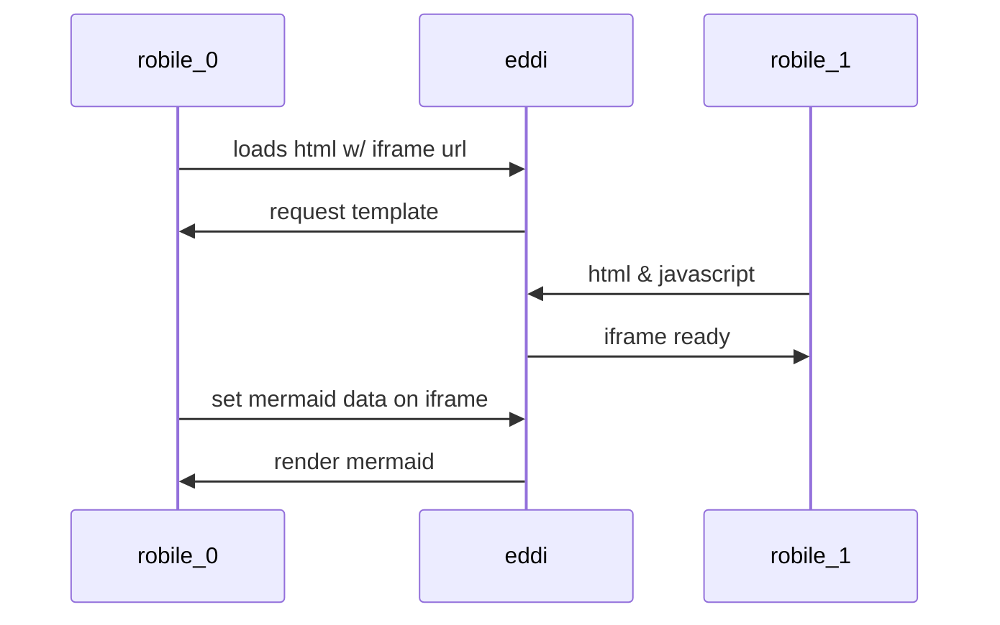

# multi_robile_navigation_experiments
# multi_robile_navigation_experiments

```mermaid
sequenceDiagram
    participant robile_0
    participant eddi
    participant robile_1
    robile_0->>eddi: loads html w/ iframe url
    eddi->>robile_0: request template
    robile_1->>eddi: html & javascript
    eddi->>robile_1: iframe ready
    robile_0->>eddi: set mermaid data on iframe
    eddi->>robile_0: render mermaid
```
