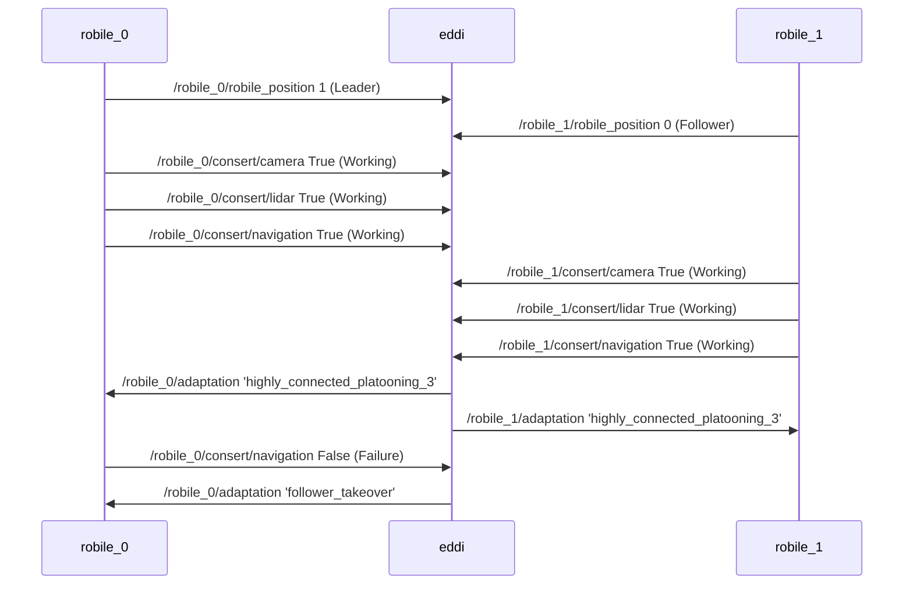

# multi_robile_navigation_experiments
# multi_robile_navigation_experiments

```mermaid
sequenceDiagram
    participant robile_0
    participant eddi
    participant robile_1
    robile_0->>eddi: /robile_0/robile_position 1 (Leader)
    robile_1->>eddi: /robile_1/robile_position 0 (Follower)

    robile_0->>eddi: /robile_0/consert/camera True (Working)
    robile_0->>eddi: /robile_0/consert/lidar True (Working)
    robile_0->>eddi: /robile_0/consert/navigation True (Working)

    robile_1->>eddi: /robile_1/consert/camera True (Working)
    robile_1->>eddi: /robile_1/consert/lidar True (Working)
    robile_1->>eddi: /robile_1/consert/navigation True (Working)
    

    eddi->>robile_0: /robile_0/adaptation 'highly_connected_platooning_3'
    eddi->>robile_1: /robile_1/adaptation 'highly_connected_platooning_3'

    robile_0->>eddi: /robile_0/consert/navigation False (Failure)
    eddi->>robile_0: /robile_0/adaptation 'follower_takeover'
```
